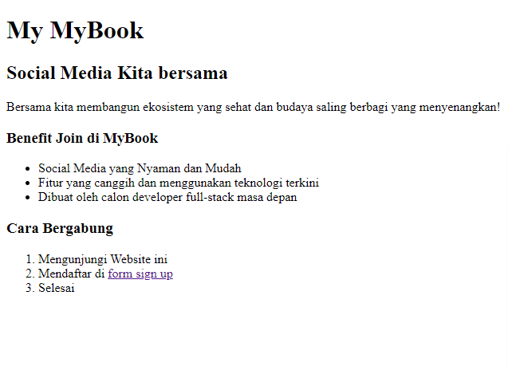

# Resume HTML(Hypertext Markup Language)

## Frontend

Frontend adalah bagian dari website yang membuat tampilan menarik kepada user. Frontend dibangun oleh 3 komponen utama yang masing-masing memiliki fungsi yang berbeda:

- HTML berfungsi sebagai struktur yang akan membangun komponen website yang kita buat.
- CSS berfungsi membuat tampilan website kita menjadi menarik.
- Javascript, pada javascript kita dapat memberikan fungsi-fungsi yang akan membuat website kita lebih interaktif.

## HTML

HTML (Hypertext Markup Language) adalah sebuah standar yang digunakan secara luas untuk menampilkan halaman web.

### Kegunaan HTML

- membuat struktur dari halaman website
- mengatur tampilan dan isi dari halaman web
- membuat table dengan tag html table
- membuat form html
  membuat gambar dengan canvasmempublikasikan halaman web secara online

# Task

membuat struktur website sederhana dengan html

