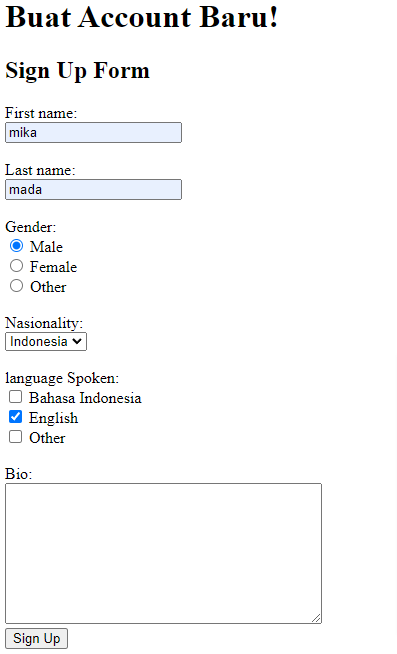
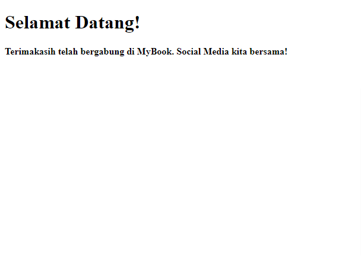

# Resume HTML(Hypertext Markup Language)

## Frontend

Frontend adalah bagian dari website yang membuat tampilan menarik kepada user. Frontend dibangun oleh 3 komponen utama yang masing-masing memiliki fungsi yang berbeda:

- HTML berfungsi sebagai struktur yang akan membangun komponen website yang kita buat.
- CSS berfungsi membuat tampilan website kita menjadi menarik.
- Javascript, pada javascript kita dapat memberikan fungsi-fungsi yang akan membuat website kita lebih interaktif.

## HTML

HTML (Hypertext Markup Language) adalah sebuah standar yang digunakan secara luas untuk menampilkan halaman web.

### Kegunaan HTML

- membuat struktur dari halaman website
- mengatur tampilan dan isi dari halaman web
- membuat table dengan tag html table
- membuat form html
  membuat gambar dengan canvasmempublikasikan halaman web secara online

## Dokumentasi HTML

- <! DOCTYPE html> mendefinisikan dokumen sebagai html5
- < html > elemen root dari html
- < head > berisi informasi meta tentang dokumen
- < title > menentukan judul untuk dokumen
- < body > berisi konten halaman yang terlibat

## Tag Heading & Paragraph HTML

headig di bagi menjadi 6:

1. h1
2. h2
3. h3
4. h4
5. h5
6. h6

## Styling pada Paragraph HTML

- strong: membuat text lebih tebal
- em: text italic
- s: text dengan garis tercoret
- br: line break untuk membuat baris baru

# Task

membuat struktur website sederhana dengan html
ketika link sign up ditekan maka akan mengarah ke halaman form.html. ketika semua data sudah terisi tombol sign up akan mengerah ke halaman welcome.html

