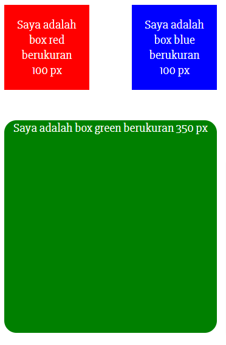

# Resume CSS (Cascading Style Sheet)

Demo Task: https://mikamada.github.io/

## menambahkan file CSS

ada 3 cara menambahkan file css ke dalam html

1. External CSS
   - membuat file dengan ekstensi .css lalu pada file html di dalam head buat link yang mengarah ke file.css.
2. Internal CSS
   - dibuat di dalam file html menggunakan syntax style, kita bisa menulskan css di dalam syntax style tersebut.
3. Inline CSS
   - css ini dapat digunakan untuk elemen tunggal pada html.
   - diprioritaskan untuk style yang unik.

## Syntax CSS

contoh kita akan mengubah color dan font-size pada h1:

```css
h1 {
  color: red;
  font-size: 25px;
}
```

## CSS Selector

CSS Selector adalah pola yang digunakan untuk memeilih element yang ingin di styling.

Penanda HTML ke dalam CSS. Dapat menggunakan selector ID dan Class.

1. id -> (#)
   - Setia
   - elemen hanya dapat memiliki satu tag id.
   - dalam satu halam tidak boleh ada nama id.yang sama.
2. class -> (.)
   - Tag class dengan nama yang sama dapat dipakai berulang-ulang pada satu halaman.
   - Satu elemen boleh memiliki lebih dari satu Class yang berbeda-beda.

contoh penggunaan css selector:

file.html

```html
    <html>
        <body>
            <div id: "content">
                Alterra Academy
            </div>
        </body>
    </html>
```

file.css

```css
#content {
  font-size: 25px;
  color: #333333;
  font-family: "Arial", sans-serif;
}
```

## CSS Grouping

Beberapa selector dapat dikelompokkan dalam satu deklarasi style.
file.html

```html
    <html>
        <body>
            <div id: "content">
                <h1>
                    Hai!
                </h1>
                <h2>
                    Alpha Tech Academy
                </h2>
            </div>
        </body>
    </html>
```

file.css

```css
h1,
h2 {
  color: #333333;
  font-family: "Arial", sans-serif;
}
```

## CSS Font

Beberapa style font pada css:

| nama        | fungsi                                              |
| ----------- | --------------------------------------------------- |
| font        | Menetapkan semua properti font dalam satu deklarasi |
| font-size   | Menentukan ukuran font text                         |
| font-weight | Menentukan ketebalan font text                      |
| font-style  | Menentukan font text menjadi miring                 |

## Task

1. File1.html
   - membuat 3 div dan ditambahkan css, setiap div meiliki warna yang berbeda.
   - pada div dengan class blue ubah position menjadi absolute agar dapat posisinya dapat di pindah-pindah
   - setiap ada child dengan position absolute maka parent nya harus satu dimensi dengan position relative.
   - pada div dengan class green di tambahkan border-radius untuk menambahkan lengkungan disetiap sudut elemen



2. file2.html
   - membuat website sederhana dengan menggunakan HTML dan CCS.
   - pada website tersebut terdapat 3 bagian yaitu header/navbar, content, footer.
     pada bagian header peserta ditugaskan untuk membuat dengan semenarik mungkin dan responsive.


