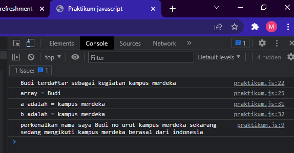

# Praktikum Javascript

1. 

2. Jawablah pertanyaan di bawah sesuai dengan materi yang telah dijelaskan.
   1. karena pada variable terdaftar bernilai false, sedangkan pada if tersebut untuk menampilkannya, terdaftar harus bernilai true.
   2. karena variable nama merupakan variable const atau nilai tetap dan tidak dapat di ubah nilainya(reasignment).
   3. tidak bisa, karena baris ke 28 merupakan error dikarenakan variable asal merupakan variable function scope yang dapat digunakan di function itu sendiri.
3. ```javascript
   const foo = ["Budi", "Sita", "Ayu"];
   const [a, b, c] = foo;
   console.log(a); // Budi
   console.log(b); // Sita
   console.log(c); // Ayu
   ```
4. ```javascript
   let bdays = ["10-17", "05-17", "20-19"];
   bdays[0] = "10/17";
   bdays[1] = "05/17";
   bdays[2] = "20/19";
   console.log(bdays);
   // ['10/17', '05/17', '20/19']
   ```
5. ```javascript
   let value = [1, 2, 3, 4, 5, 6];
   let map = value.map((e) => e * 2);
   console.log(map); // [2, 4, 6, 8, 10, 12]
   ```
6. ```javascript
   let arr = [1.5, 2.56, 5.1, 12.33];
   let arr2 = arr.map((e) => Math.round(e));
   console.log(arr2); // [2, 3, 5, 12]
   ```
