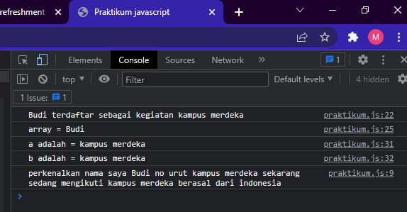

# Javascript

Javascript adalah bahasa pemograman yang Hight-level, Scripting, Untyped dan Interpreted.

## Pengertian var, let, const

### Declaration

Declaration adalah proses pembuatan varialbel penyimpan data.

- var

pada var variable dapat di redeclaration & reassignment.

```javascript
var num = 20;
console.log(num);
var num = 30;
console.log(num);
var num;
```

- let

pada let tidak dapat di redeclaration, tetapi bisa di reassignment.

```javascript
let num1 = 20;
console.log(num);
num1 = 30;
console.log(num);
```

- const

pada const tidak dapat di reclaration & reassignment karena merupakan variable yang bersifat tetap dan isi variable tidak bisa diubah;

```javascript
const num2 = 20;
```

## Scoping

Scoping menentukan dimana variable, fungsi, dan objek diatur dan dapat diakses dalam kode kita. Ini berarti ruang lingkup b=variable dikendalikan oleh lokasi deklarasi.

- Global scope

```javascript
var a = "indonesia";
```

- function/local scope

```javascript
function countAverage() {
  let num = 1;
  let num2 = 4;
}
```

- block scope

```javascript
if (true) {
  let num2 = 12;
}
```

## Destructing

Destructing adalah ekspresi dari javascript yang memungkinkan untuk mneyalin nilai dari array, atau properti dari objeck, kedalam variable yang berbeda.

- Array Destructing

```javascript
let arr = [1, 2, 3];
let [a, b, c] = arr;
console.log(a);
// maka nilai a = 1;
```

- Object Destructing

```javascript
const user = {
    id = 42;
    is_verified = true;
}

const {id, is_verified} = user;
console.log(id); // 42
```

## Method array

method merupakan sebuah fungsi yanf terkait dengan object, membuat programnya se-sederhana mungkin sesuai kegunaan.

### concat

menggabungkan dua tau lebih array dan mengembalikan salinan array yang digabungkan.

```javascript
let arr1 = [1, 2, 3];
let arr2 = [4, 5, 6];
let arr3 = arr1.concat(arr2);
```

### map

membuat array baru dengan hasil memnaggil fungsi untuk setiap elemen array.

```javascript
let arr1 = [1,2,3];
let arr2 = arr1,map(e => e * 2);
```

### forEach

```javascript
let arr1 = ["a", "b", "c"];
arr1.forEach((e) => console.log(e));
```

## control flow

mengatur alur eksekusi pada statement atau jalannya program sesuai keinginan kita.

## try catch

```javascript
try {
  tidakKetemu();
} catch (error) {
  console.log(error);
}
```

## throw

```javascript
function percobaan(angka) {
    if(angka * 0 !==0) {
        throw new Error("Bukan angka !");
    }
    retutn "Ini angaka";
}

try {
    console.log(percobaan('a'));
} catch (error) {
    console.log(error);
}
```

## function

digunakan untuk melakukan serangkaian komputasi / prosedur yang dapat digunakan berulang kali.

```javascript
// declarasi function
function namaLengkap(depan, belakang) {
  console.log(depan + " " + belakang);
}

// panggil function
namaLengkap("Rudy", "Setiawan");
```

# Task

menampilkan hasil pada console sesuai soal yang diberikan

