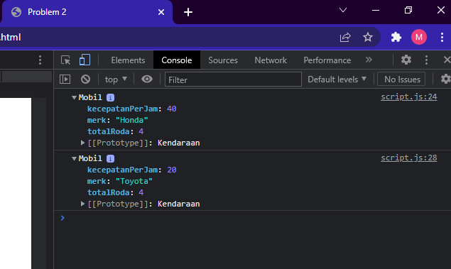

# Resume Clean Code

Clean Code adalah istilah untuk kode yang mudah dibaca, dipahami, dan diubah oleh programmer.

## Fungsi Clean Code

1. Work Collaboration
2. Feature Development
3. Faster Development

## Karakteristik Clean Code

1. Penamaan variable mudah dipahami
   nama harus merepresentasikan dari nilai yang ada di dalamnya.
   contoh:

```javascript
let userBalance = 125.0;
let primeList = [2, 3, 4, 7];
```

2. mudah dieja dan dicari

```javascript
const currentData = moment().format("YYYY/MM/DD");
```

3. singkat namun mendeskripsikan konteks

```javascript
function inviteUser(emailAddress) {}
```

4. Konsisten

```javascript
const DAYS_IN_WEEK = 7;
const DAYS_IN_MONTH = 30;
```

5. Hindari penambahan konteks yang tidak perlu

```javascript
// contoh salah
// kenapa penamaan seperti ini salah? karena di dalam fullName pasti bertype data string
let fullNameString;

// contoh benar
let fullName;
```

6. Komentar
   Clean Code yang baik kita hanya memberi komentarbpada satu block code tertentu dan komentar di letakkan diatas kode yang ingin dikomentasi.

7. Good function
   ketika kita membuat sebuah function pada aturan clean code function tidak boleh terlalu banyak argument. Contoh yang benar adalah kita membuat sebuah object dalam parameter tersebut dengan itu kita tau apa yang kita isi. misal:

```Go
function creatMenu({ title, body, buttonText, cancellable }) {
    creatMenu({
        title: 'Foo',
        body: 'Bar',
        buttonText: 'Baz',
        cancellable: true
    });
}
```

8. Gunakan konvensi style guide
9. formating

- lebar baris code 8-120 karakter.
- satu class 300-500 baris.
- baris code yang berhubungan saling berdekatan.
- dekatkan fungsi dengan pemanggilnya.
- deklarasi variabel berdekatan dengan penggunanya.
- perhatikan identasi.
- menggunakan prettier atau formatter.

## Clean Code Principle

### KISS (Keep It So Simple)

contoh kita harus menghindari fungsi yang mengerjakan lebih dari satu hal.

#### Tips KISS

- fungsi dan class harus simple
- fungsi dibuat untuk melakukan satu tugas
- jangan gunakan terlalu banyak argument
- harus diperhatikan untuk mencapai kondisi yang seimbang
- kecil dan jumlahnya minimal

### DRY (Dont't Repeat Yourself)

Duplikasi code terjadi karena sering copy paste. untuk menghindari duplikasi buatlah function yang dapat digunakan secara berulang.

### Refactoring

Refactoring adalah proses restrukturisasi yang dibuat, dengan cara mengubah struktur internal tanpa mengubah perilaku eksternal. Prinsip KISS & DRY dapat dicapai dengan cara refactor.

# Task

1. menganalisa penulisan kode pada soal
2. mengubah code menjadi code clean
   
