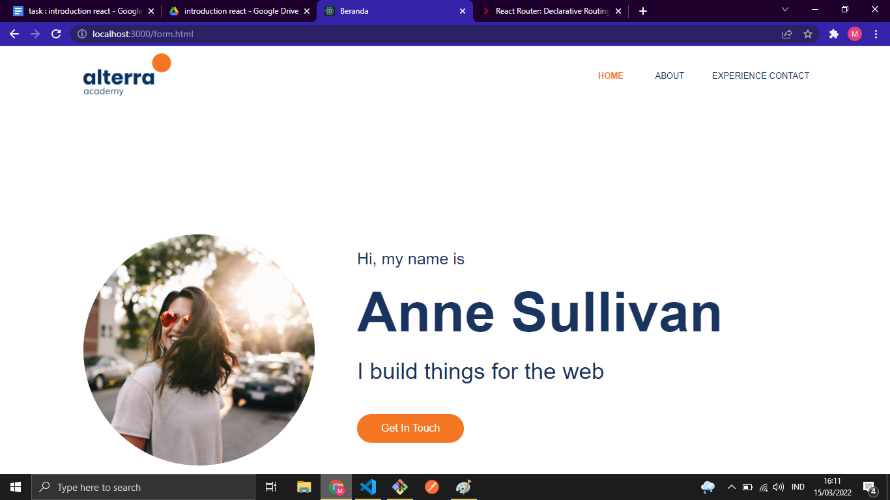
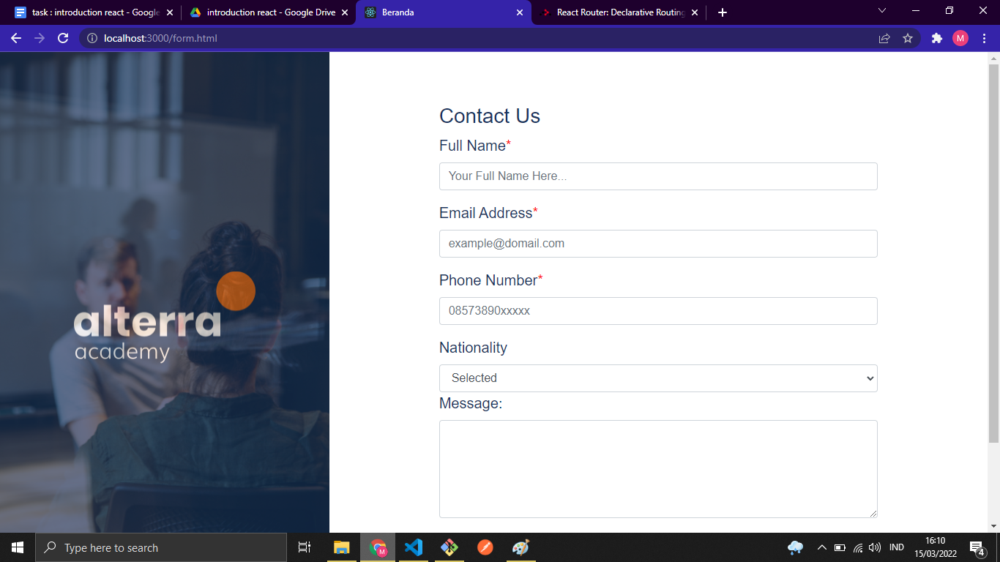

# Introduction React

- React adalah Library javascript untuk membuat user interface (UI) yang interaktif dan cepat pada web maupun mobile.
- Open source yang di maintain oleh Facebook.
- Pada arsitektur MVC (Model – View – Controller), Reactjs hanya akan mengambil peran pada layer View saja.

# Virtual DOM

Representasi dari UI berbentuk Javascript Object yang disimpan pada memori

```javascript
import React from "react";
import ReactDom from "react-dom";

ReactDom.render(<App />, document.getElementById("root"));
```

## Masalah yang dihadapi dengan DOM manipulation

1. DOM manipulation secara manual dapat membuat code berantakan
2. Sulit untuk mengingat DOM state sebelumnya
3. Jauh lebih lambat daripada operasi javascript pada umumnya.

# Task

### Introduction React

1. Memebuat project baru dengan react
2. Mengkonversi file html yang disediakan dengan asset ke bentuk react




