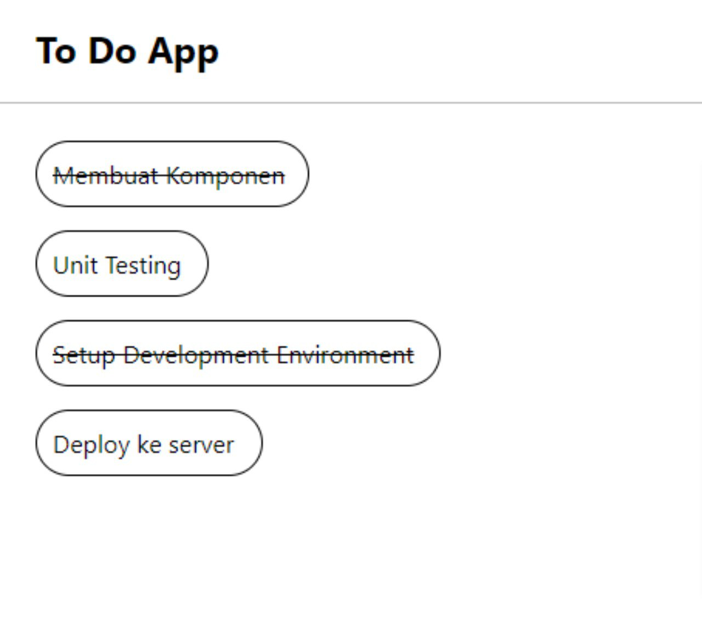

# React Fundamental

## JSX

JSX adalah singkatan dari Javascript XML. Merupakan ekstensi syntax
pada Javascript. Penggunanan JSX sangat disarankan di react karena lebih menggambarkan apa yang harus ditampilkan pada UI. JSX menghasilkan React "elements".

### Alasan menggunakan JSX?

- JSX dibuatkan berdasarkan fakta kalau logika rendering sangat terikat dengan logic UI.
- Separation of Technologi -> Separation if Concern.

### JSX vs React.createElement

- JSX memudahkan kita menulis aplikasi react
- Syntactic sugar dari fungsi

### Memanaruh Expression pada jsx

```js
const name = 'Faris';
const element = <h1>Hello, {name}</h1>;

ReactDOM.render(element, document.getElementById('root'));
```

### Menentukan atribut pada jsx

- tanda kutib untuk
  menentukan string literal

```js
const element = <div tabIndex="0"></div>;
```

- kurung kurawal menyematkan ekspresi js

```js
const element = </img>;
```

## Komponen React

Komponen react adalah bagian kode yang dapat digunakan kembali
yang digunakan menentukan tampilan, behavior,
dan state sebagian ui.

### function dan class component

```js
// function component
function Welcome() {
	return <h1>Welcome</h1>;
}

// class component
class Welcome extend React.Component {
  render() {
    return <h1>Welcome</h1>;
  }
}
```

### Membuat dan merender component

```javascript
function Welcome() {
	return <h1>Welcome</h1>;
}

const element = <Welcome />;
ReactDOM.render(elemen, document.getElementById('root'));
```

## Komposisi komponen dan props

### Props

- singkatan dari peoperties. membuat kita dapat menambahkan argument pada component.
- props membantu membuat komponen menjadi lebih dinamis.
- props dioper ke komponen sama seperti memberikan atribut tag html.
- props pada komponen adalah read-only / tidak dapat diubah.

## Lifecycle method umum pada react

1. render()
   - fungsi yang sering dipakai
   - Required pada class component
   - pure function tidak boleh ada setState

```js
class Hello extend Component{
  render(){
    return <div> hello {this.props.name}</div>;
  }
}
```

2. componentDidMount()

   - dipanggil ketika komponen sudah dirender pertama kali
   - tempat yang tepat untuk pemanggilan api
   - boleh ada setState()

3. componentDidUpdate()

   - dipanggil ketika terjadi update(props atau state berubah)

```js
componentDidUpdate(prevProps){
  if(this.props.userName !== prevProps.userName) {
    this.fetchData(this.props.userName);
  }
}
```

4. componentWillUnmount()
   - dipanggil ketika komponen akan dihancurkan
   - cocok untuk clean up action

```js
componentWillUnmount(){
  window.removeEventListener('resize', this.risizeListener);
}
```

## Render bersyarat dan list

### Render Bersyarat

pada react kita dapat membuat komponen berbeda
yang mencakup perilaku yang dibutuhkan. Lalu kita dapat me-render hanya beberapa bagian saja. Berdasarkan state dari aplikasi anda.

- menggunakan if
- inline if dengan opertaor &&
- inline if-else dengan operator ternary
- mencegah komponen untuk rendering

```js
function Greating(props) {
	const isLoggedIn = props.isLoggedIn;
	if (isLoggesIn) {
		return <UserGreating />;
	}
	return <GuestGreating />;
}

ReactDOM.render(
	<GuestGreating isLoggedIn={false} />,
	document.getElementById('root');
);
```

### Render List

```js
function NumberList(props) {
	const number = props.number;
	const listItem = number.map((number) => (
		<listItem key={number.toString()} value={number} />
	)
  return(
    <ul>{listItem}<ul>
  ));
}
```

## Styling

### classes dan css

```css
/* style.css */
.button {
	backgroun-color: yellow;
}
```

```js
// button.jsx
import './style.css';

const Button = () => {
	return <button className="button">A button</button>;
};
```

### Atribut style

```js
const Button = () => {
	return <button style={{ backgorunColor: 'yellow' }}>A button</button>;
};

const buttonStyle = { backgroundColor: 'yellow' };
const Button = () => {
	return <button style={buttonStyle}>A button</button>;
};
```

# Task

Membuat To Do App dengan react.

