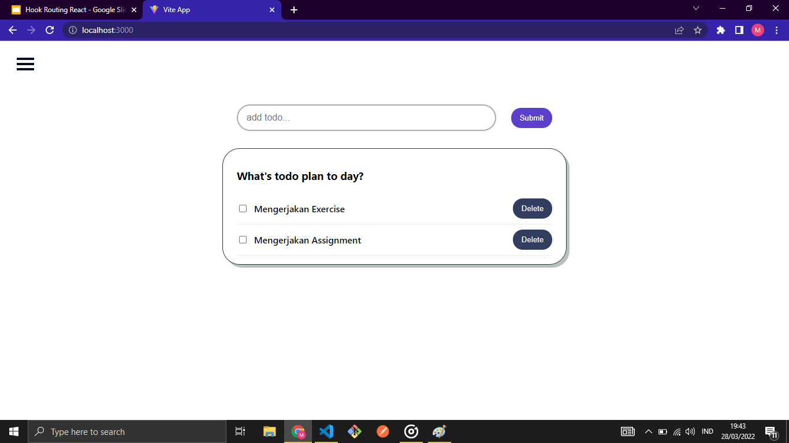
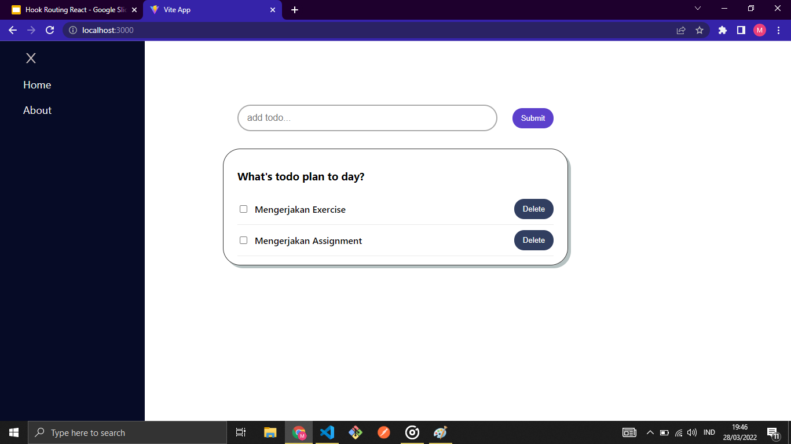
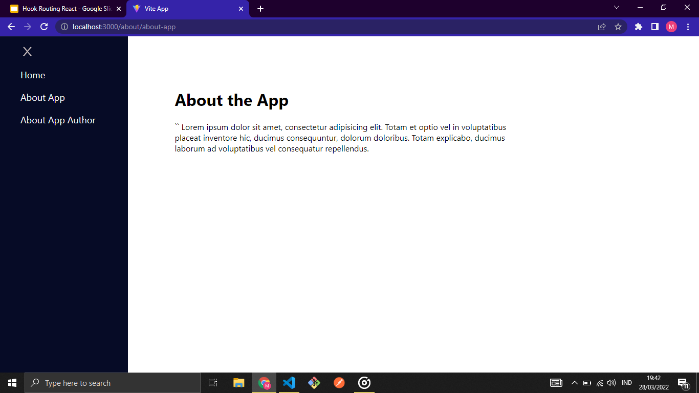

# Router

Router adalah modul dalam react yang berfungsi untuk melakukan proses navigasi pada SPA(Single Page Application).

## SPA(Single Page Application)

SPA(Single Page Application) adalah satu jenis aplikasi website dimana ada satu halaman yang menangani semua aktivitas yang terjadi dalam aplikasi tersebut.

### Keunggulan SPA

- waktu loading website jauh lebih cepat
- tidak ada query tambahan ke server
- front-end yang cepat dan responsif
- meningkatkan pengalaman pengguna (User Interface)

### Kekurangan SPA

- Tidak bagus dalam hal SEO
- berat saat di load/buka pertama kali
- kurang aman dibanding website biasa
- Masalah kompatibilitas browser

## React Router

### Browser Router

Browser Router digunakan sebagai router yang menggunakan API history dari HTMl5, sehingga dapat menggunakan location untuk sinkronkan UI dengan url. Di dalam object location mempresentasikan dimana lokasi aplikasi sekarang.

### Routes

Routes digunakan untuk membungkus kumpulan beberapa component Route.

### Route

Route digunakan sebagai pengarah jalan nya lalu lintas suatu aplikasi web.

### Link

Link digunakan untuk berpindah antar halaman, property to merujuk pada path di route yang akan dituju.

# Url Parameter

Url Parameter adalah suatu parameter yang nilainya ditetapkan secara dinamis di url halaman.

```jsx
<Route> path="/movie/:id" element={<MovieDetail />} </Route>
```

## Kegunaan URL Parameter

1. Paginasi
2. Penyortiran dan penyaringan
3. Pencarian
4. Menggambarkan

# Task





Pada saat navbar dibuka di halaman Home hanya terdapat dua navlink yaitu Home dan About, ketika About ditekan akan melakukan navigasi ke halaman About App dan pada saat navbar dibuka terdapat tiga navlink yaitu Home, About App, dan About Author
