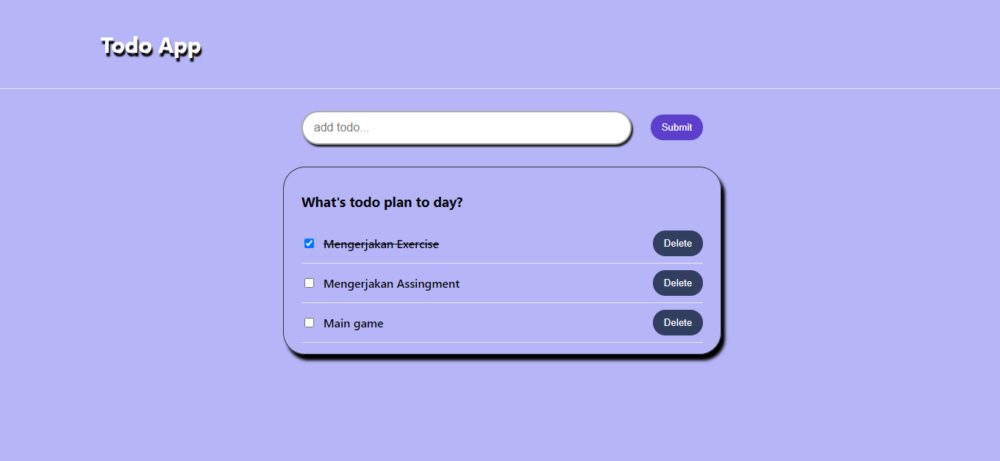

# Event Handling

## State

State adalah data private sebuah component. Data ini hanya tersedia untuk component tersebut dan tidak bisa diakses oleh component lain.

1. Data yang bisa dimodifikasi menggunakan sesState
2. Setiap terjadi modifikasi akan terjadi render ulang
3. Bersifat Asynchronous
4. Dipakai dalam class

## Stateful & Stateless Component

Stateful Component adalah memiliki state. Component ini dibuat dengan class. Kelebihan dari class component adalah mempunyai lifecycle. Stateless Component adalah tidak memiliki state hanya prop. Umumnya component ini dibuat dengan function karena code nya lebih ringkas.

- Stateful Component

```jsx
import { Component } from 'react';
import Child from './Child';

class Parent extends Component {
	constructor(props) {
		super(props);
		this.state = {
			nilai: 1,
		};
	}
	render() {
		return (
			<div>
				<Child nilai={this.state.nilai} />
			</div>
		);
	}
}

export default Parent;
```

- Stateless Component

```jsx
import { Component } from 'react';

class Child extends Component{
  return(
    <div>
      <p>hasilnya adalah {this.props.nilai}</p>
    </div>
  );
}

export default Child;
```

## Penanganan Event pada React

Handling Event adalah suatu metode untuk menangani sebuah event/aksi yang diberikan pengguna kepada suatu komponen.
Event adalah suatu peristiwa yang dipicu oleh pengguna pada suatu komponen.

### Contoh Event

- Clipboard Events (Promise terpenuhi)
- Form Events (onChange, onSubmit)
- Mouse Events (onClick, onDoublrClick, onMouseOver)
- Gneric Events (onError, onLoad)

Contoh:

```jsx
import { Component } from 'react';

class Test extends Component {
	constructor(props) {
		super(props);
	}

	eventClick = () => {
		const h1 = document.querySelector('div h1');
		h1.style.color = 'red';
		console.log(h1);
	};
	render() {
		return (
			<div>
				<h1 onClick={this.eventClick}>Hello, World</h1>
			</div>
		);
	}
}

export default Parent;
```

# Task

Praktikum 13 adalah membuat Todo App.

- input todo, pada saat tombol submit di click data akan dikirim di list todo.
- pada list todo ada chekcbox dan ketika diklik todo adakan tercoret.
- tombol Delete untuk menghapus todo


