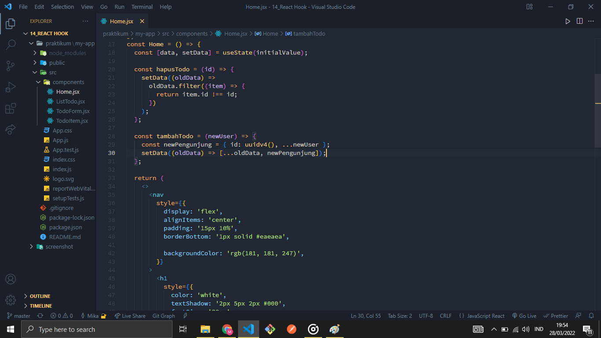
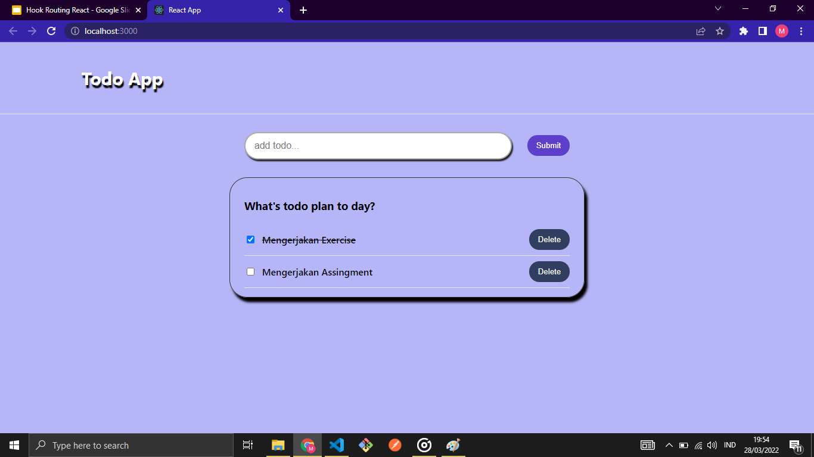

# React Hooks

Hooks merupakan fitur baru di React 16.8. Dengan Hooks kita dapat menggunakan state dan fitur React yang lain tanpa perlu menulis kelas.

## Hooks pada React

### Hooks dasar

- useState
- useEffect
- useContext

### Hooks tambahan

- useReducer
- useCallback
- useMemo
- useRef
- useImperactiveHandle
- useLayoutEffect
- useDebagValue

Aturan Hooks: panggil Hooks dirtingkat atas hjangan panggil Hooks dari dalam loops, conditions, atau nested function. Jangan memanggil Hooks dari fungsi-fungsi javaScript biasa. kita dapat:

- Memanggil Hooks dari komponen fungsi React,
- Memanggil Hooks dari custom Hooks.

# Implementasi Hooks

## useState

```jsx
import React, { useState } from 'react';

function Example() {
	// Declare a new state variable, which we'll call "count"
	const [count, setCount] = useState(0);

	return (
		<div>
			<p>You clicked {count} times</p>
			<button onClick={() => setCount(count + 1)}>Click me</button>
		</div>
	);
}
```

## useEffect

```jsx
import React, { useState, useEffect } from 'react';

function Example() {
	const [count, setCount] = useState(0);

	// Similar to componentDidMount and componentDidUpdate:
	useEffect(() => {
		// Update the document title using the browser API
		document.title = `You clicked ${count} times`;
	});

	return (
		<div>
			<p>You clicked {count} times</p>
			<button onClick={() => setCount(count + 1)}>Click me</button>
		</div>
	);
}
```

# Custom Hooks

Membuat Hooks kita sendiri memungkinkan kita mengekstrak komponen logika ke fungsi yang dapat digunakan lagi.

# Task




Pada task ini kita harus merubah class component pada react menjadi Hooks atau functional component.
