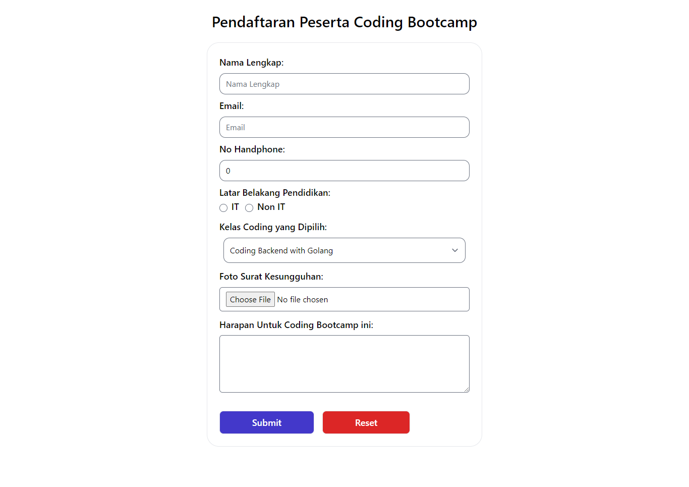

# React Form

## Penerapan form

Form merupakan salah satu hal penting dalam pengembangan aplikasi website. Form dapat digunakan untuk menghandle inputan dari user.

### Macam-macam form

- Elemen `<input>`
- Elemen `<textarea>`
- Elemen `<selec>`
- Radio Button `<input type='radio'>`
- Checkbox `<input typee="checkbox">`

### type elemen input

- text (default)
- button
- color
- checkbox
- date
- datetime-local
- email
- file
- hidden
- image
- month
- number
- password
- radio
- range
- reset
- search
- submit
- tel
- time
- url
- week

## Controlled Component

Kita dapat menggabungkan cara menyimpan dan memperbarui state di HTML dan React dengan menggunakan state pada React. Kemudian Komponen React yang me-render sebuah form juga mengontrol apa yang terjadi dalam form tersebut pada masukan pengguna selanjutnya.

Sebuah elemen masukan form yang nilainya dikontrol oleh React melalui cara seperti ini disebut sebagai ”controlled component“.

## Uncontrolled Component

Sebuah controlled input menerima nilai saat ini sebagai prop, serta callback untuk mengubah nilai tersebut. Kita bisa mengatakan ini adalah cara yang lebih "React way" untuk pendekatan ini (yang tidak berarti harus selalu menggunakannya).

Tetapi nilai input ini harus ada di state yang disimpan di suatu tempat. Biasanya, komponen yang merender input (alias form component) menyimpannya di state-nya. Tentu saja, itu bisa dalam state komponen lain, atau bahkan di penyimpanan state terpisah (separate state store), seperti Redux .

Form controlled dan uncontrolled memiliki kelebihannya sendiri. Kita perlu mengevaluasi situasi kita secara spesifik dan memilih pendekatan apa yang cocok untuk kondisi kita.

Jika formulir sangat sederhana dalam hal umpan balik UI, uncontrolled dengan refs sepenuhnya baik-baik saja. Kita tidak perlu mendengarkan apa yang dikatakan berbagai artikel bahwa uncontrolled itu "buruk". Lagipula kita selalu dapat bermigrasi ke controlled input.

## Basic Validation

Pada dasarnya, ada 3 alasan mengapa validasi form diperlukan :

- Mencari input data yang benar dan sesuai format. Sebuah web/aplikasi tidak dapat berjalan dengan benar, jika data yang diolah tidak sesuai dengan kebutuhan aplikasi
- Melindungi akun pengguna. Misalnya, membuat pengguna untuk memasukkan data password yang aman
- Melindungi sistem/aplikasi. Validasi form yang kuat dapat meminimalisir perilaku pengguna yang ingin meretas sistem/aplikasi

## Tipe validasi data formulir

### Client-side validation

Validasi yang dilakukan pada sisi klien (browser). Validasi ini dilakukan agar data input sesuai dengan kebutuhan form, sebelum data form dikirimkan ke server.

Kelebihan validasi sisi klien ialah user-friendly, karena jika terjadi kesalahan pengguna akan langsung diberitahu. Pengguna tidak harus menunggu respon dari server untuk mengetahui hasil validasi.
Validasi sisi klien, terbagi atas dua bagian

- Built-in form validation, yaitu menggunakan fitur validasi langsung dari HTML5. Biasanya, validasi ini tidak membutuhkan Javascript dan memiliki performa yang lebih baik. Tapi tidak dapat dikostumisasi. Kadang pesan errornya cukup ‘kaku’. Contohnya : required, minlength, maxlength, min, max, type dan patten
- Menggunakan Javascript. Ini membuat validasi form dapat dikostumisasi. Tetapi kita perlu membuatnya sendiri.

## Server-side validation

Validasi yang dilakukan pada sisi server. Sisi server bertugas untuk memvalidasi data kembali, sebelum disimpan di database. Jika ditemukan kesalahan, maka response akan dikirim kembali ke client berupa koreksi atas kesalahan yang dibuat oleh pengguna.

Berbeda dengan validasi sisi klien, validasi ini tidak user-friendly. Karena, koreksi kesalahan akan dikirimkan, setelah form di-submit.

## Built-in form validation

- required, contoh: `<input required />`
- minlength & maxlength contoh: `<input minlength='4' maxlength='9' />`
-
- min & max digunakan input bertipe number untuk mengatur nilai minimun dan maximum angka contoh: `<input min='4' max='9' />`
- type, digunakan untuk menentukan apakah data berupa angka, email, atau type yang lainnya.
- pattern pattern digunakan untuk menentukan regular expression (regex) yang mendefinisikan pola data yang boleh dimasukkan. contoh: `<input pattern='^(buah /w*)' />`

## Menggunakan Javascript

Ketika ada perubahan di form. Ketika ada perubahan, akan mentrigger event onChange. Kkup real-time berdasarkan perubahan data, namun fungsi akaelebihannya validasi akan cun terus dipanggil selama ada perubahan. Bisa dikombinasikan dengan disable button.
Ketika menekan tombol submit. Ketika menekan tombol submit, akan mentrigger event onSubmit. Kelebihannya validasi cukup sekali, namun tidak akan real-time memvalidasi form.

# Task

- Membuat handle input
- input nama lengkap harus berupa huruf jika tidak pesan error akan ditampilkan
- input email jika email tidak sesuai pesan error akan ditampilkan
- input no HP berupa number dan minlength 9 dan maxlength 14
