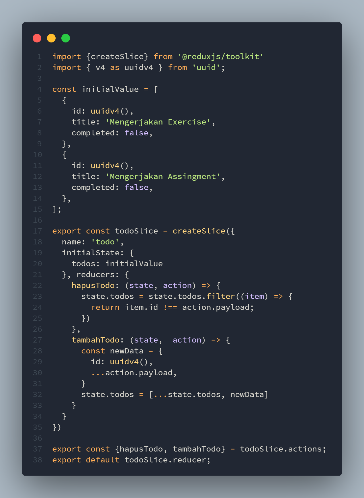
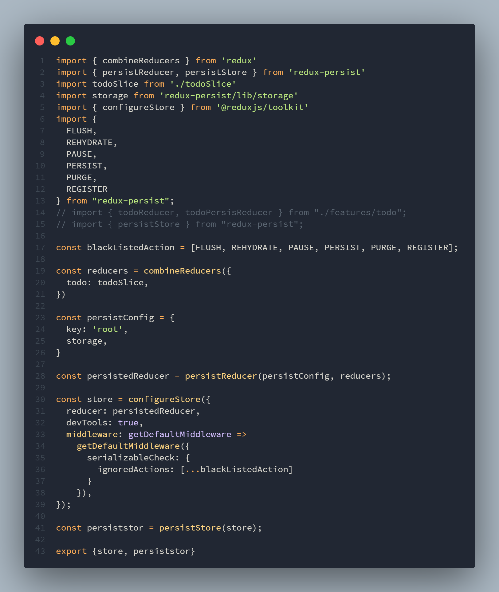
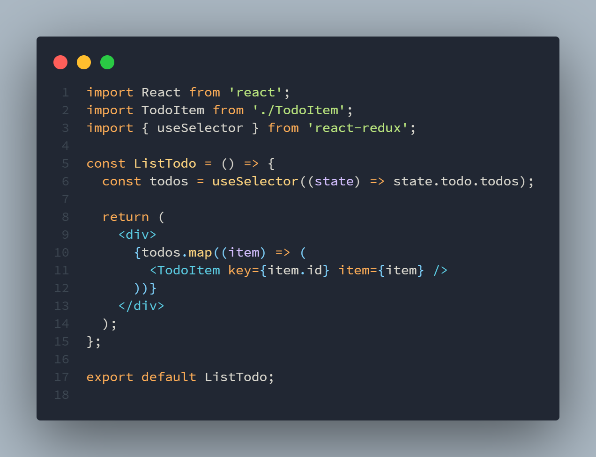

# Global State Management

## Kapan saat yang tepat menggunakan Redux

1. Banyak state yang perlu ditaruh di banyak tempat
2. State pada app sering berubah
3. Logic untuk mengubah state kompleks
4. ukuran codebase yang sedang-besar, dan dikerjakan oleh banyak orang
5. Perlu untuk mengetahui bagaimana state diupdate seiring dengan waktu

## Redux Libraries dan Tools

1. React-Redux
2. Redux-toolkit
3. Redux DevTools Extension

## Komponen penting di redux

1. Actions
2. Reduceer
3. store

## Memaka dan mengubah state

1. Hooks
2. Connect

## Redux Thunk

Thunk Middleware untuk redux yang memungkinkan kita untuk membuat action creator yang mengembalikan function bukan action.

## Kenapa perlu redux thunk

untuk menghandle side effect logic seperti logic synchronous kompleks yang perlu mengakses store dan juga async request data.

# Task

Mengubah state ke Redux dan menyimpan ke local storage

