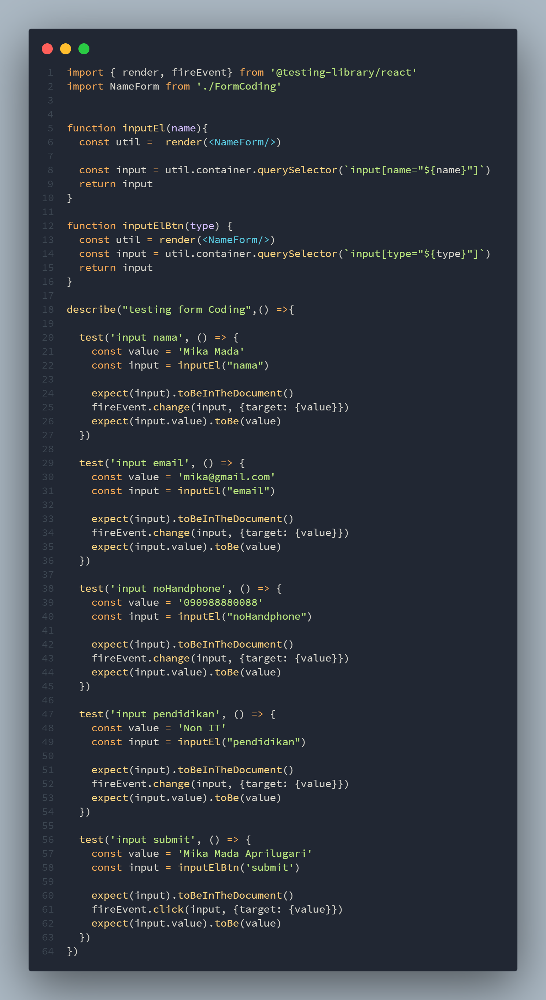

# Testing Introduction

Testing adalah proses memverifikasi bahwa test assertions kita benar dan bahwa code kita tetap benar sepanjang masa aplikasi.

## Tools untuk testing

- jest
- react testing librari (RTL)

## Kategori testing

- LabelText: getByLabelText
- PlaceholderText: getByPlaceholderText
- AltText: getAltText
- DisplayValue: getByDisplayValue

# Testing Custom Hook

Untuk mengetes custom hook kita menggunakan React Hooks Testing Library. Dia akan memberikan kita alat untuk mengetes hooks tnapa merender satu komponen.

# Task

Pada praktikum ini kita membuat testin pada component yang sudah di sediakan

