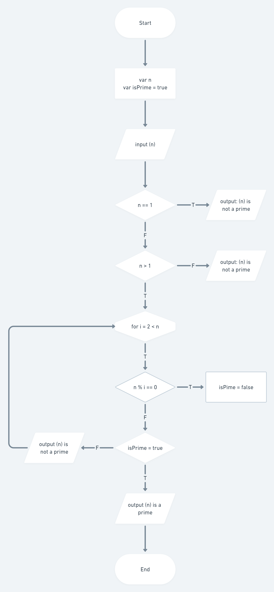

# Introduction Algorithm

input => process => output

Algoritma adalah prosedur komputasi yang mendefinisikan dengan baik yang mengambil nilai sebagai input dan menghasilkan nilai output.

## Karakteristik Algortima

- memiliki batas (awal dan akhir)
- instruksi terdefinisi dengan baik
- efektif dan efisien

## Flowchart

Flowchart adalah suat bagan dengan simbol tertentu yang menggambarkan urutan dan ubungan antar proses secara detail.

# Task

membuat flowchart pada kasus yang sudah ditentukan

