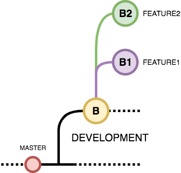
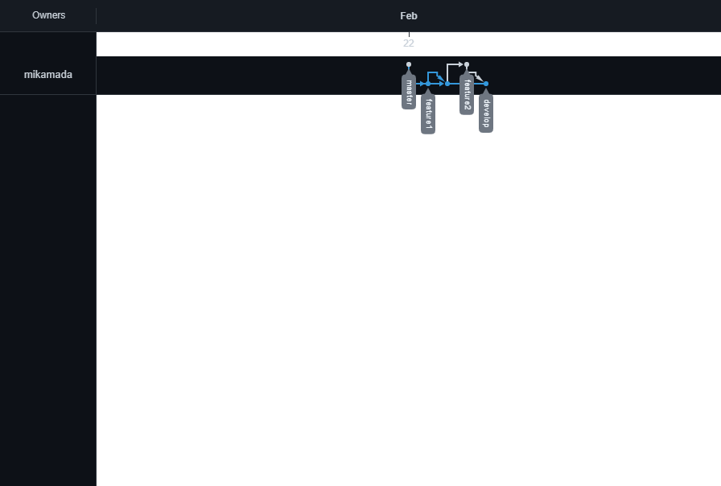

# Version Control and Branch Management (Git)

Link Praktikum: https://github.com/mikamada/praktikum_git

## Resume

Dalam materi section 2 ini mempelajari:

1. Git
2. Perintah dasar Git
3. Workflow Collaboration

## Git

Versioning berfungsi mengatur versi dari source code program.
Git adalah Salah satu version control system populer yang digunakan para developer untuk mengembangkan software secara bersama-bersama. Git dibuat oleh Linus Torvald pada tahun 2005, Dengan menggunakan git kita dapat mengerjakan project yang kita buat di local dan server github.

## Perintah dasar Git

1. Git init : untuk membuat repository pada file lokal yang nantinya ada folder .git
2. Git status : untuk mengetahui status dari repository lokal
3. Git add : menambahkan file baru pada repository yang dipilih
4. Git commit : untuk menyimpan perubahan yang dilakukan, tetapi tidak ada perubahan pada remote repository.
5. Git push : untuk mengirimkan perubahan file setelah di commit ke remote repository.
6. Git branch : melihat seluruh branch yang ada pada repository
7. Git checkout : menukar branch yang aktif dengan branchyang dipilih
8. GIt merge : untuk menggabungkan branch yang aktif dan branch yang dipilih
9. Git clone : membuat Salinan repository lokal

## Workflow Collaboration

Workflow Collaboration ini adalah bagaimana alur kerja yang tepat untuk berkolaborasi dengan GitHub.
Contoh workflow yang benar:

branch master adalah branch utama untuk menampung project ketika semuanya sudah selesai dengan masalah atau bug apapun, branch development digunakan untuk testing, contoh branch b1 membuat sistem login pada app lalu di merge ke branch develop untuk di coba, jika sistem tersebut sudah baik dan tidak terjadi bug maka akan di merge ke branc master.

## Task

membuat praktikum Git dari pembelajaran Version Control and Branch Management (Git):

